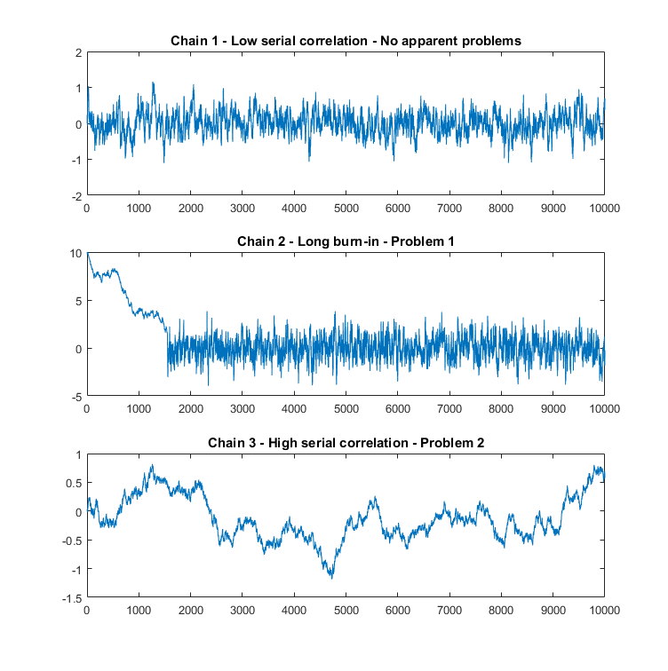

## Tanı Testleri

Sonsal dağılımı hesapladıktan sonra MCMC algoritmalarının yapısı gereği bazı tanı testleri yapmamız gerekir:

*  MCMC ile  tane örneklem çektiğimizi varsayalım, . Örneklemimizi iki ayrı parçaya bölelim:  ve . Bu iki grubun ortalamalarını hesaplayalım:


 

Bu iki ortalama birbirlerinden anlamlı derecede farklı ise, örneklemimiz problemlidir.

* MCMC algoritması birden çok zincir ile çalıştırılır ve farklı örneklemler elde edilir. Farklı zincirlerde aynı sonuçları elde etmemizi bekleriz. Bu nedenle zincirler arasında anlamlı fark olup olmadığını test ederiz.

* Yine  tane örneklem çektiğimizi düşünelim ve aşağıdaki üç grafiği inceleyelim:



İlk grafikte herhangi bir anomali görünmemektedir. 

İkinci grafikte, yaklaşık ilk 1500 örneklem, geri kalanlardan daha farklı görünmektedir. Büyük ihtimalle, başlangıç dağılımı, hedef dağılımdan oldukça farklıdır ancak zincir hedef dağılıma yakınsamayı başarmıştır.

Üçüncü grafikte ise, örneklemler arasında ciddi bir otokorelasyon bulunmaktadır. Büyük ihtimalle efektif örneklem büyüklüğü küçük olduğu için bu problem ile karşılaşılmıştır.

* Otokorelasyon ve kısmi otokorelasyon grafikleri incelenerek örneklemlerin otokorelasyon sorunu olup olmadığı kontrol edilmelidir.

* Gelman-Rubin istatistiği hesaplanıp ```1.1```'den küçük olup olmadığı kontrol edilmelidir.

* Sonsal dağılımın şekli kontrol edilmelidir.

## Bilgi Kriterleri

 olmak üzere T tane modeli karşılaştırmak istediğimizi düşünelim.

### Akaike Bilgi Kriteri (AIC)

Amaç, gerçek  ve tahmin edilen  arasındaki Kullback-Leibler ıraksamasını minimum yapmaktır:


Burada,  bir sabit olduğundan,


ifadesini maksimize etmek yeterli olacaktır. Akaike'ye göre en iyi model, maksimum  değerini verir. Monte Carlo integrasyonu ile  integralini hesaplarsak,


Bu da bize  tahmini için log-benzerlik  değerini verir. Akaike,  değerinin  değerini modelin karmaşıklığına (: modeldeki parametre sayısı) bağlı olarak aşırı tahmin ettiğini göstermiştir:


ve aşağıdaki kriteri önermiştir:


Akaike bilgi kriteri, doğrusal regresyon, genelleştirilmiş doğrusal modeller, otoregresif modeller için uygun olsa da, derin sinir ağlar, mixture modeller için uygun değildir.

### Watanabe–Akaike Bilgi Kriteri (WAIC)

Akaike bilgi kriterinin singüler istatistiksel modeller için genelleştirilmiş halidir ve Akaike bilgi kriterinin Bayesci versiyonudur. 

# Kaynaklar
* [Model Checking and Selection](https://hciweb.iwr.uni-heidelberg.de/sites/default/files/profiles/mkandemi/files/lecture6_0.pdf)
* [WAIC Experiments](http://watanabe-www.math.dis.titech.ac.jp/users/swatanab/dicwaic.html)
* [A Widely Applicable Bayesian Information Criterion](http://www.jmlr.org/papers/volume14/watanabe13a/watanabe13a.pdf)
* [MCMC Diagnostics](https://www.statlect.com/fundamentals-of-statistics/Markov-Chain-Monte-Carlo-diagnostics)